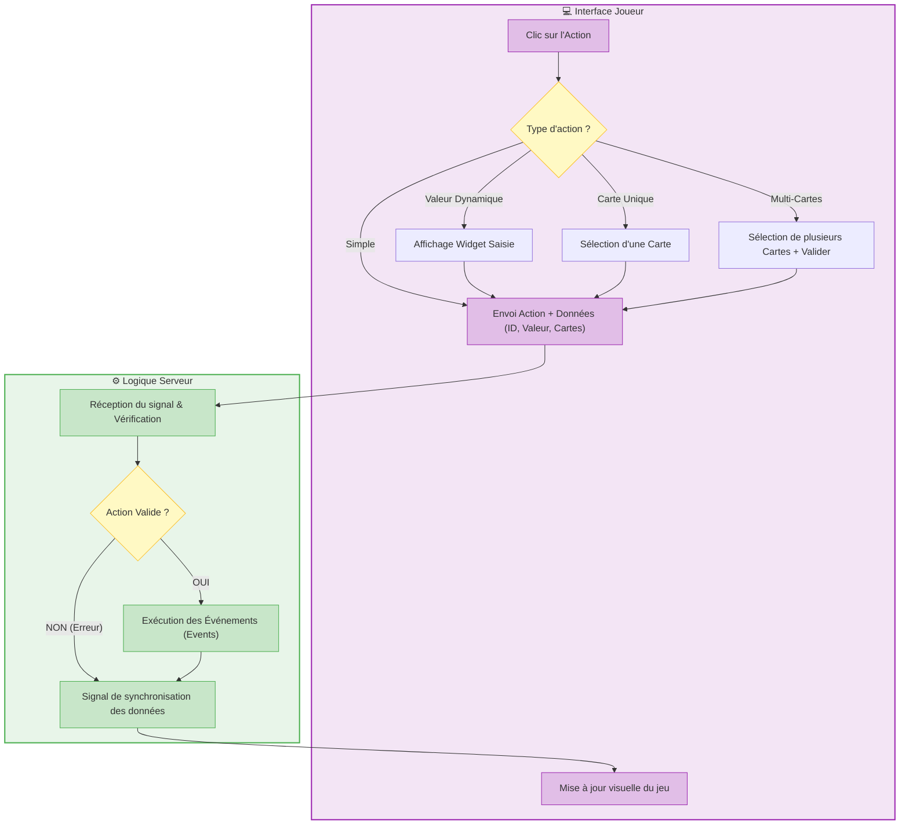

# InsertedValue Event

```mermaid
flowchart TB
    subgraph JOUEUR["💻 Interface Joueur"]
        A["Clic sur l'Action"]
        
        %% Logique de sélection de type
        TYPE{"Type d'action ?"}
        
        VAL["Affichage Widget Saisie"]
        CARD1["Sélection d'une Carte"]
        CARD_MULTI["Sélection de plusieurs Cartes + Valider"]
        
        SEND["Envoi Action + Données (ID, Valeur, Cartes)"]
        
        I["Mise à jour visuelle du jeu"]
    end

    subgraph SERVEUR["⚙️ Logique Serveur"]
        B["Réception du signal & Vérification"]
        
        CHECK{"Action Valide ?"}
        
        EXEC["Exécution des Événements (Events)"]
        SYNC["Signal de synchronisation des données"]
    end

    %% Flux Joueur
    A --> TYPE
    
    TYPE -- "Simple" --> SEND
    TYPE -- "Valeur Dynamique" --> VAL
    TYPE -- "Carte Unique" --> CARD1
    TYPE -- "Multi-Cartes" --> CARD_MULTI

    VAL --> SEND
    CARD1 --> SEND
    CARD_MULTI --> SEND

    %% Flux Joueur -> Serveur
    SEND --> B
    
    %% Flux Serveur
    B --> CHECK
    CHECK -- "OUI" --> EXEC
    CHECK -- "NON (Erreur)" --> SYNC
    
    EXEC --> SYNC
    
    %% Flux Serveur -> Joueur
    SYNC --> I

    %% Styles
    style A fill:#E1BEE7,stroke:#9c27b0
    style SEND fill:#E1BEE7,stroke:#9c27b0
    style I fill:#E1BEE7,stroke:#9c27b0
    
    style B fill:#C8E6C9,stroke:#4caf50
    style EXEC fill:#C8E6C9,stroke:#4caf50
    style SYNC fill:#C8E6C9,stroke:#4caf50
    
    style TYPE fill:#FFF9C4,stroke:#FBC02D
    style CHECK fill:#FFF9C4,stroke:#FBC02D

    style JOUEUR fill:#f3e5f5,stroke:#9c27b0,stroke-width:2px
    style SERVEUR fill:#e8f5e9,stroke:#4caf50,stroke-width:2px


```