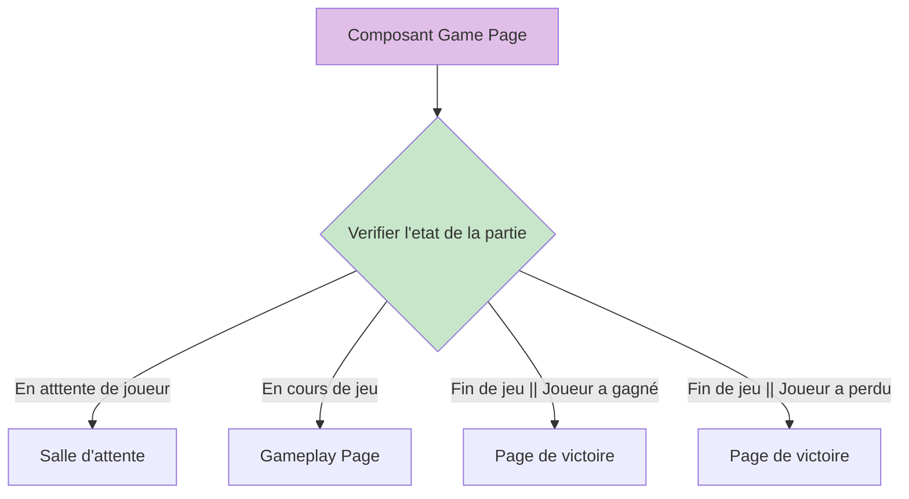

# Game Page Affichage

```mermaid
flowchart TB
    A["Composant Game Page"] --> B@{ label: "Verifier l'etat de la partie" }
  
    B -- En atttente de joueur --> D@{ label: "Salle d'attente" }
    B -- En cours de jeu --> E["Gameplay Page"]
    B -- Fin de jeu || Joueur a gagné --> G["Page de victoire"] 
    B -- Fin de jeu || Joueur a perdu --> C["Page de victoire"] 

    B@{ shape: diamond}
    D@{ shape: rect}
    style A fill:#E1BEE7
    style B fill:#C8E6C9 
```

# Structure du projet et liens symboliques

```mermaid

flowchart TB
    %% Root Node
    Root["CARD Games"] 

    %% Main Shared Folders & Files
    Root --> pages["/pages"]
    Root --> src["/src"]
    Root --> component["/components"]
    Root --> assets["/assets"]
    Root --> data["/data"]
    Root --> env["env.js"]

    %% Application: Player App
    Root --> playerApp["player-app"]
    subgraph PlayerAppGroup [Environnement Joueur]
        playerApp --> p_idx["index.html"]
        playerApp --> p_main["main.js"]
        %% Symlinks for Player App
        playerApp -.-> p_pages_sl["pages (SymLink)"]
        playerApp -.-> p_src_sl["src (SymLink)"]
        playerApp -.-> p_comp_sl["components (SymLink)"]
        playerApp -.-> p_assets_sl["assets (SymLink)"]
        playerApp -.-> p_data_sl["data (SymLink)"]
        playerApp -.-> p_env_sl["env.js (SymLink)"]
    end

    %% Application: Test App
    Root --> testApp["test-app"]
    subgraph TestAppGroup [Environnement Test]
        testApp --> t_idx["index.html"]
        testApp --> t_main["main.js"]
        %% Symlinks for Test App
        testApp -.-> t_pages_sl["pages (SymLink)"]
        testApp -.-> t_src_sl["src (SymLink)"]
        testApp -.-> t_comp_sl["components (SymLink)"]
        testApp -.-> t_assets_sl["assets (SymLink)"]
        testApp -.-> t_data_sl["data (SymLink)"]
        testApp -.-> t_env_sl["env.js (SymLink)"]
    end

    %% --- STYLING ---
    style Root fill:#E1BEE7,stroke:#333,stroke-width:2px,color:#000
    
    %% Pages (Jaune)
    classDef colorPages fill:#FFF9C4,stroke:#FBC02D
    class pages,p_pages_sl,t_pages_sl colorPages

    %% Src (Bleu)
    classDef colorSrc fill:#BBDEFB,stroke:#1976D2
    class src,p_src_sl,t_src_sl colorSrc

    %% Components (Orange)
    classDef colorComp fill:#FFE0B2,stroke:#FB8C00
    class component,p_comp_sl,t_comp_sl colorComp

    %% Assets (Vert)
    classDef colorAssets fill:#C8E6C9,stroke:#388E3C
    class assets,p_assets_sl,t_assets_sl colorAssets

    %% Data (Gris/Bleu)
    classDef colorData fill:#D1C4E9,stroke:#512DA8
    class data,p_data_sl,t_data_sl colorData

    %% Env (Rouge/Rose clair pour les fichiers de config)
    classDef colorEnv fill:#FFCDD2,stroke:#E53935
    class env,p_env_sl,t_env_sl colorEnv

    %% Apps Containers
    style playerApp fill:#f5f5f5,stroke:#9e9e9e
    style testApp fill:#f5f5f5,stroke:#9e9e9e
    
    %% Style pour différencier visuellement les SymLinks (Bords pointillés)
    classDef isSymlink stroke-dasharray: 5 5
    class p_pages_sl,p_src_sl,p_comp_sl,p_assets_sl,p_data_sl,p_env_sl isSymlink
    class t_pages_sl,t_src_sl,t_comp_sl,t_assets_sl,t_data_sl,t_env_sl isSymlink
```
